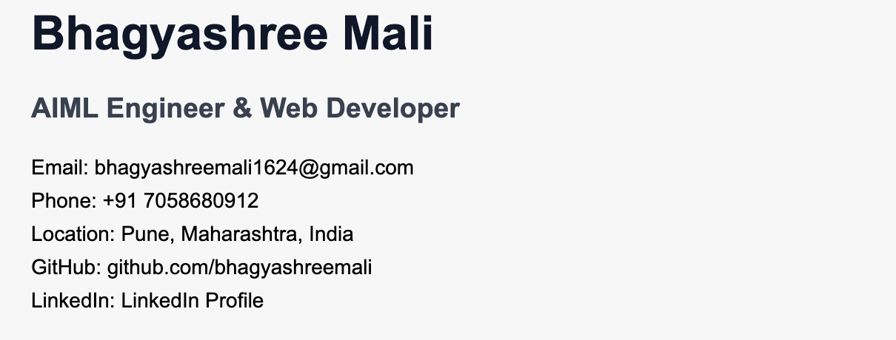
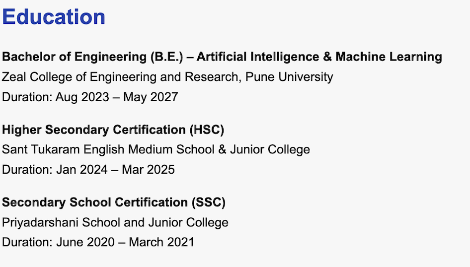

# 🚀 Interactive HTML Resume - Bhagyashree Mali

<h1 align="center">👋 Hey, I'm Bhagayashree Mali</h1>
<div align="center">
  <a href="https://git.io/typing-svg">
    
  </a>

  <p>
    <a href="mailto:bhagyashreemali1624@gmail.com">
      
    </a>
    <a href="[https://www.linkedin.com/in/bhagyashreemali](https://www.linkedin.com/in/bhagyashree-mali/)">
      
    </a>
    <a href="github.com/bhagyashreemali">
      
    </a>
  </p>
</div>

<br>


---

## 📋 Table of Contents

- [About the Project](#-about-the-project)
- [Features](#-features)
- [Tech Stack](#-tech-stack)
- [Skill Levels](#-skill-levels)
- [Project Structure](#-project-structure)
- [Getting Started](#-getting-started)
- [Screenshots](#-screenshots)
- [Usage](#-usage)
- [Roadmap](#-roadmap)
- [Contributing](#-contributing)
- [License](#-license)
- [Contact](#-contact)
- [Acknowledgments](#-acknowledgments)

---

## 🎯 About the Project

This repository contains my **professional resume** built entirely with **semantic HTML5** - basic CSS, no JavaScript - just pure, accessible markup! The project demonstrates clean code structure, proper HTML semantics, and professional documentation.

### 🌟 Why This Project?

- **Simplicity**: Pure HTML showcasing fundamental web development skills
- **Accessibility**: Semantic HTML ensures screen reader compatibility
- **Professionalism**: Clean, organized structure following industry standards
- **Portfolio Piece**: Demonstrates attention to detail and documentation skills

### 🎓 Background

As a B.E. student in **Artificial Intelligence and Machine Learning** at Zeal College of Engineering and Research, I'm passionate about building intelligent solutions and creating impactful web applications. This resume represents my journey in tech, showcasing my skills, projects, and experiences.

---

## ✨ Features

- ✅ **Pure HTML5** - No external dependencies
- ✅ **Semantic Markup** - Proper use of HTML5 semantic elements
- ✅ **Accessible** - Screen reader friendly
- ✅ **Responsive Structure** - Well-organized sections
- ✅ **Professional Layout** - Clean and readable format
- ✅ **Easy to Update** - Simple structure for quick modifications
- ✅ **Print Friendly** - Browser default styling works great for printing
- ✅ **SEO Optimized** - Proper heading hierarchy and meta tags

---

## 🛠️ Tech Stack

<div align="center">

### Languages & Markup


### Tools & Platforms


</div>

---

## 💪 Skill Levels

<div align="center">

### Programming Languages


### Web Technologies


### AI/ML & Data Science


### Databases


### Tools & Platforms


</div>

### 📊 Animated Progress Bars

```
Programming Languages
████████████████████████████████████░░░░░ Python (90%)
████████████████████████████████░░░░░░░░░ Java (85%)
████████████████████████████░░░░░░░░░░░░░ C++ (80%)

Web Development
██████████████████████████████████████░░░ HTML/CSS (95%)
████████████████████████████████░░░░░░░░░ React.js (85%)
████████████████████████████░░░░░░░░░░░░░ Node.js (80%)

AI/ML & Data Science
██████████████████████████████████░░░░░░░ Machine Learning (85%)
████████████████████████████████░░░░░░░░░ Deep Learning (80%)
████████████████████████████████████░░░░░ NLP (85%)
```

---

## 📁 Project Structure

```
resume-project/
│
├── 📄 resume.html              # Main HTML resume file
├── 📄 README.md               # Project documentation (this file)
├── 📄 LICENSE                 # MIT License
│
├── 📁 screenshots/            # Project screenshots
    ├── full-resume.png
    ├── header-section.png
    ├── skills-section.png
    ├── projects-section.png
    └── mobile-view.png
    

```

---

## 🚀 Getting Started

### Prerequisites

All you need is a modern web browser! No installations required.

- Google Chrome (recommended)
- Mozilla Firefox
- Safari
- Microsoft Edge
- Or any other modern browser

### Installation

1. **Clone the repository**

```bash
git clone https://github.com/bhagyashreemali/resume-site.git
```

2. **Navigate to the project directory**

```bash
cd resume-html
```

3. **Open the HTML file**

Simply double-click on `index.html` or open it with your preferred browser:

```bash
# For macOS
open index.html

# For Linux
xdg-open index.html

# For Windows
start index.html
```

That's it! No build process, no dependencies, just pure HTML! 🎉

---

## 📸 Screenshots

### Full Resume View

> **Screenshot Placeholder**: Full page view of the HTML resume


<p align="center">
  
  
  
</p>


---

### Header Section

> **Screenshot Placeholder**: Header with name and contact information


<p align="center">
  
</p>


---

### Technical Skills Section

> **Screenshot Placeholder**: Skills organized by category

<p align="center">
  
</p>


---

### Experience Section

> **Screenshot Placeholder**: Professional experience with internships


<p align="center">
  
</p>


---

---

### Projects Showcase

> **Screenshot Placeholder**: Featured projects with descriptions


<p align="center">
  
</p>


---

### Education & Certifications

> **Screenshot Placeholder**: Academic background and certifications


<p align="center">
  
</p>


---

### Mobile View

> **Screenshot Placeholder**: Responsive view on mobile devices


<p align="center">
  
  
</p>


---

## 💻 Usage

### Viewing the Resume

1. Open `index.html` in any web browser
2. The resume will display with browser default styling
3. All sections are clearly separated with horizontal lines
4. Links are clickable (email, LinkedIn, GitHub)

### Printing the Resume

1. Open the HTML file in your browser
2. Press `Ctrl + P` (Windows/Linux) or `Cmd + P` (Mac)
3. Adjust print settings as needed
4. Save as PDF or print directly

### Customizing for Your Use

1. Open `index.html` in any text editor
2. Update the personal information in the `<header>` section
3. Modify sections as per your experience
4. Add/remove projects, skills, or certifications
5. Save and reload in browser to see changes

---

## 🗺️ Roadmap

- [x] Create basic HTML structure
- [x] Add all resume sections
- [x] Add horizontal line separators
- [x] Create comprehensive README
- [ ] Add CSS version for enhanced styling
- [ ] Create JavaScript version with interactive features
- [ ] Add dark mode toggle
- [ ] Implement print-specific styling
- [ ] Create PDF auto-generation script
- [ ] Add multilingual support (Hindi/Marathi)
- [ ] Build React.js version
- [ ] Deploy on GitHub Pages

---

## 🤝 Contributing

Contributions, issues, and feature requests are welcome! Feel free to check the [issues page]https://github.com/bhagyashreemali/resume-site/issues.

### How to Contribute

1. Fork the Project
2. Create your Feature Branch (`git checkout -b feature/AmazingFeature`)
3. Commit your Changes (`git commit -m 'Add some AmazingFeature'`)
4. Push to the Branch (`git push origin feature/AmazingFeature`)
5. Open a Pull Request

## 📜 License

MIT License

Copyright (c) 2025 bhagyashreemali

Permission is hereby granted, free of charge, to any person obtaining a copy
of this software and associated documentation files (the "Software"), to deal
in the Software without restriction, including without limitation the rights
to use, copy, modify, merge, publish, distribute, sublicense, and/or sell
copies of the Software, and to permit persons to whom the Software is
furnished to do so, subject to the following conditions:

The above copyright notice and this permission notice shall be included in all
copies or substantial portions of the Software.

THE SOFTWARE IS PROVIDED "AS IS", WITHOUT WARRANTY OF ANY KIND, EXPRESS OR
IMPLIED, INCLUDING BUT NOT LIMITED TO THE WARRANTIES OF MERCHANTABILITY,
FITNESS FOR A PARTICULAR PURPOSE AND NONINFRINGEMENT. IN NO EVENT SHALL THE
AUTHORS OR COPYRIGHT HOLDERS BE LIABLE FOR ANY CLAIM, DAMAGES OR OTHER
LIABILITY, WHETHER IN AN ACTION OF CONTRACT, TORT OR OTHERWISE, ARISING FROM,
OUT OF OR IN CONNECTION WITH THE SOFTWARE OR THE USE OR OTHER DEALINGS IN THE
SOFTWARE.


---

## 📧 Contact

**Bhagyashree Mali**

- 📧 Email: **BHAGYASHREEMALI1624@gmail.com**  
- 🔗 LinkedIn: [www.linkedin.com/in/bhagyashree-mali]  
- 🧠 GitHub: https://github.com/bhagyashreemali
- 📍 Location: Pune, Maharashtra, India

---

## 🙏 Acknowledgments

- [Shields.io](https://shields.io/) - For amazing badges
- [Readme Typing SVG](https://github.com/DenverCoder1/readme-typing-svg) - For animated typing effect
- [GitHub Profile Views Counter](https://github.com/antonkomarev/github-profile-views-counter) - For profile view counter
- [Contrib.rocks](https://contrib.rocks/) - For contributor images
- **Zeal College of Engineering and Research** - For academic support
- **My Job Grow** - For AI internship opportunity
---


---

## 🌊 Activity Wave

```
         .∞•∞.
       '       '
      '         '
     '           '     Coding Journey
    '             '    ▁▂▃▄▅▆▇█▇▆▅▄▃▂▁
   '               '   Continuous Learning
  '                 '  Building Projects
 '~~~~~~~~~~~~~~~~~~~' Making Impact
```

---

<div align="center">

### 🌟 Star this repository if you found it helpful!


**Made with ❤️ by Bhagyashree Mali**

[](https://forthebadge.com)
[](https://forthebadge.com)

</div>
